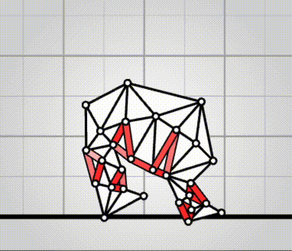
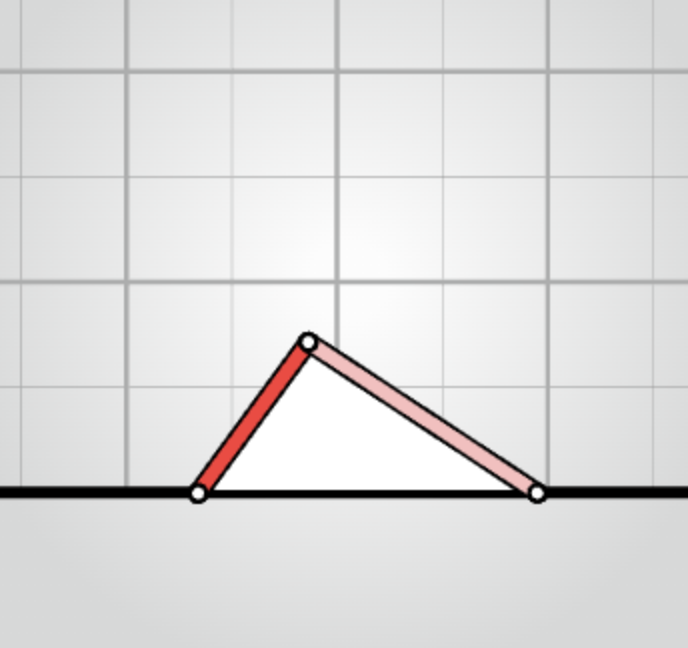
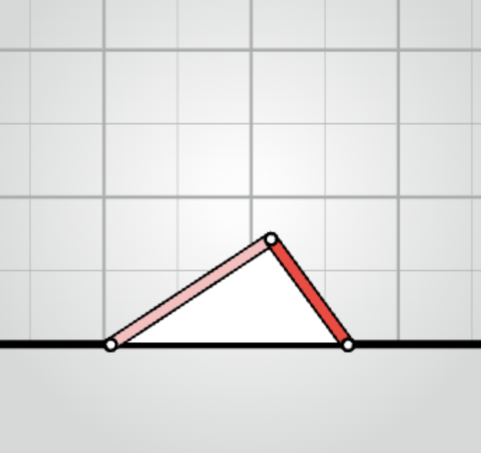
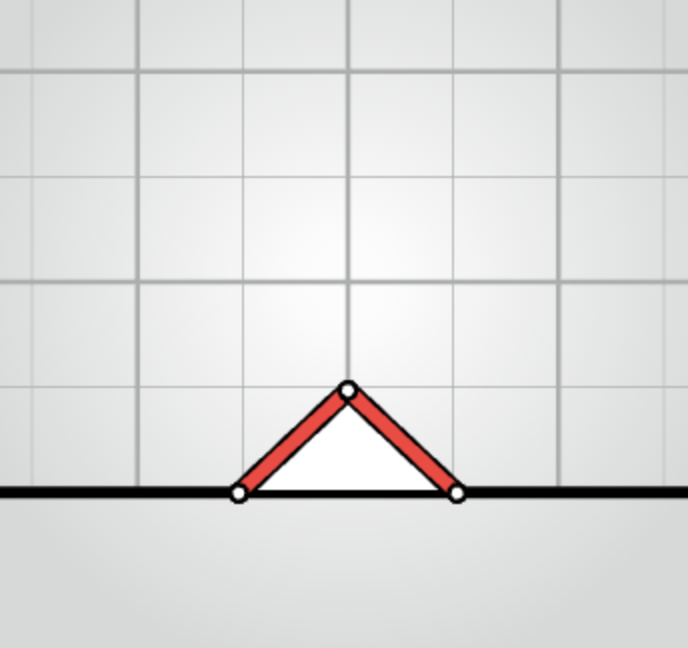

# algovivo

[](https://github.com/juniorrojas/algovivo/actions/workflows/test.yml)

A JavaScript + WebAssembly implementation of an energy-based formulation for soft-bodied virtual creatures.

## [live demo](https://juniorrojas.com/algovivo)

<a href="https://juniorrojas.com/algovivo">
  
</a>

Instead of implementing simulations using explicit position update rules and manually derived force functions, we can implement simulations using [gradient-based optimization on differentiable energy functions](https://medium.com/@juniorrojas/physics-based-simulation-via-backpropagation-on-energy-functions-6d3b0e93f5fb) and compute forces using automatic differentiation.

For example, AD can be used for [energy minimization](https://github.com/juniorrojas/hookean-springs-pytorch) and [numerical integration](https://github.com/juniorrojas/springs-integration-pytorch) for mass-spring systems. This repository contains an implementation with additional energy terms such as Neo-Hookean triangles, controllable muscles and friction. The energy functions are implemented in C++, compiled to LLVM IR, differentiated with [Enzyme AD](https://github.com/EnzymeAD/Enzyme), compiled to WASM, and wrapped as a JavaScript library.

## quick start

**Just one HTML file, no download or installation required.**

You can create a simple simulation with one triangle and two muscles, where one muscle is controlled by a periodic signal, with the following HTML code.


```html
<!DOCTYPE html>
<html>
<head>
  <meta charset="UTF-8">
</head>
<body>
  <script type="module">
    import algovivo from "https://cdn.jsdelivr.net/gh/juniorrojas/algovivo@master/build/algovivo.module.min.js";

    async function loadWasm() {
      const response = await fetch("https://cdn.jsdelivr.net/gh/juniorrojas/algovivo@master/build/algovivo.wasm");
      const wasm = await WebAssembly.instantiateStreaming(response);
      return wasm.instance;
    }

    async function main() {
      const system = new algovivo.System({
        wasmInstance: await loadWasm()
      });
      system.set({
        x: [
          [0, 0],
          [2, 0],
          [1, 1]
        ],
        triangles: [
          [0, 1, 2]
        ],
        springs: [
          [0, 2],
          [1, 2]
        ]
      });

      const viewport = new algovivo.SystemViewport({ system });
      document.body.appendChild(viewport.domElement);

      let t = 0;
      setInterval(() => {
        system.a.set([
          1,
          0.2 + 0.8 * (Math.cos(t * 0.1) * 0.5 + 0.5)
        ]);
        t++;

        system.step();
        viewport.render();
      }, 1000 / 30);
    }

    main();
  </script>
</body>
</html>
```

The code above imports the ES6 module `algovivo.module.min.js` and loads the WASM `algovivo.wasm` from [jsDelivr](https://www.jsdelivr.com/). To serve these files from your own server, you can download them from the [build](./build) directory.

## muscle commands

Muscle commands can be specified with `system.a.set([...])`. A value of 1 means that the muscle is relaxed and wants to keep its original rest length. Values less than 1 indicate that the muscle wants to contract to some fraction of its original rest length.

| `system.a.set([0.3, 1])` | `system.a.set([1, 0.3])` | `system.a.set([0.3, 0.3])`  |
| ------------- |-------------| -----|
| <div align="center"></div> | <div align="center"></div> | <div align="center"></div> |

This is achieved using an action-dependent potential energy function for each muscle.

$$
E(x, a) = \frac{k}{2} \left(\frac{l(x)}{a\ l_0} - 1\right)^2
$$

More details about this and other energy functions used in the simulation can be found [here](https://arxiv.org/abs/2102.05791).

## BibTeX

To cite this in an academic context, please use the following BibTeX entry:

```bibtex
@misc{algovivo,
  author = {Junior Rojas},
  title = {Algovivo: An energy-based formulation for soft-bodied virtual creatures},
  howpublished = {\url{https://github.com/juniorrojas/algovivo}},
  year = {2023}
}
```
