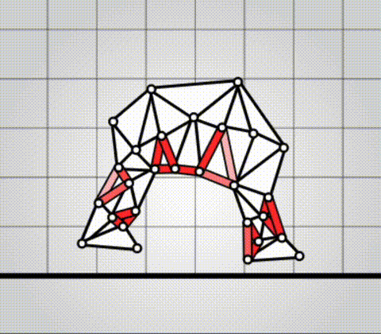
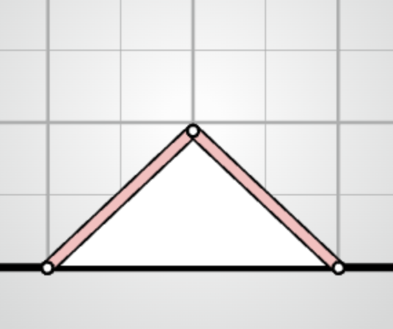
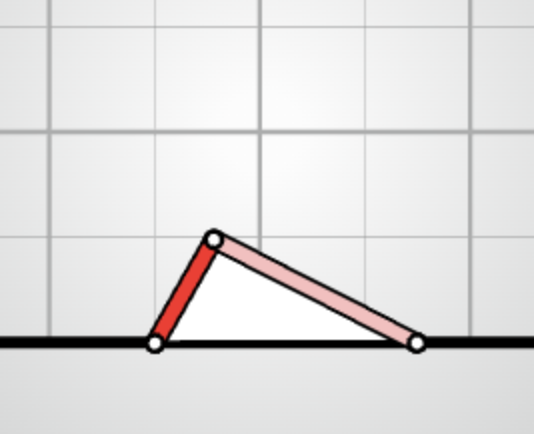

# algovivo

[](https://github.com/juniorrojas/algovivo/actions/workflows/test.yml)

A JavaScript + WASM implementation of an energy-based formulation for soft-bodied virtual creatures.

[live demo](https://juniorrojas.com/algovivo)

<a href="https://juniorrojas.com/algovivo">
  
</a>

Instead of implementing simulations using explicit position update rules and manually computed forces, we can implement simulations using gradient-based optimization on differentiable energy functions and compute forces using automatic differentiation.

For example, AD can be used for [energy minimization](https://github.com/juniorrojas/hookean-springs-pytorch) and [numerical integration](https://github.com/juniorrojas/springs-integration-pytorch) for mass-spring systems. This repository contains an implementation with additional energy terms such as Neo-Hookean triangles, controllable muscles and friction, to simulate soft-bodied virtual creatures. The energy functions are implemented in C++, compiled to LLVM IR, differentiated with [Enzyme AD](https://github.com/EnzymeAD/Enzyme), compiled to WASM, and wrapped as a JavaScript library.

## quickstart

To use in the browser, you can use a [UMD build](build/algovivo.min.js) that exposes `algovivo` as a global variable.

```html
<script src="algovivo.min.js"></script>
```

You also need the [WASM build](./build/algovivo.wasm), which you can load in the browser with JavaScript:

```js
async function loadWasm() {
  const r = await fetch("algovivo.wasm");
  const bytes = await r.arrayBuffer();
  const wasm = await WebAssembly.instantiate(bytes);
  return wasm.instance;
}
```

### `System`

```js
const system = await algovivo.makeSystem({
  wasmInstance: await loadWasm()
});

system.set({
  x: [
    [0, 0],
    [2, 0],
    [1, 1]
  ],
  triangles: [
    [0, 1, 2]
  ],
  springs: [
    [0, 2],
    [1, 2]
  ]
});
```

### `SystemViewport`

```js
const viewport = new algovivo.SystemViewport({
  system: system
});
document.body.appendChild(viewport.domElement);
viewport.render();
```

</img>

### `System.step`

```js
setInterval(() => {
  system.step();
  viewport.render();
}, 1000 / 30);
```

### muscle control

```js
system.a.set([0.2, 1]);
```

</img>

```js
system.a.set([1, 0.2]);
```

</img>

### locomotion with neural controller

TODO: instructions, coming soon!


