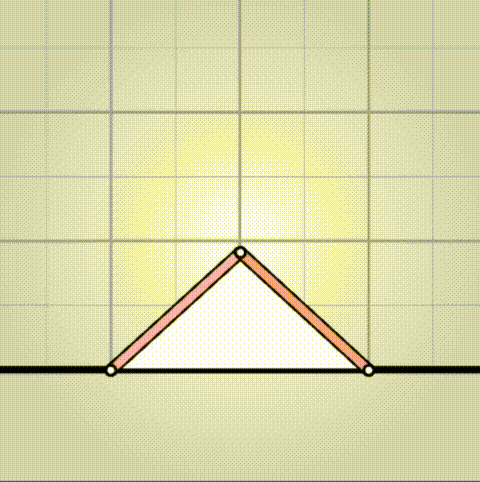

# algovivo

<p>
  <a href="https://github.com/juniorrojas/algovivo/actions/workflows/test.yml">
    
  </a>
  <a href="https://deepwiki.com/juniorrojas/algovivo">
    
  </a>
</p>

An energy-based formulation for soft-bodied [virtual creatures](https://direct.mit.edu/isal/proceedings/isal2024/36/30/123447).

## [interactive demo](https://juniorrojas.com/algovivo)

<a href="https://juniorrojas.com/algovivo">
  
</a>

Instead of implementing simulations using explicit position update rules and manually derived force functions, we can implement simulations using [gradient-based optimization on differentiable energy functions](https://medium.com/@juniorrojas/physics-based-simulation-via-backpropagation-on-energy-functions-6d3b0e93f5fb) and compute forces and other derivatives using automatic differentiation. Automatic differentiation can be used for [potential energy minimization](https://github.com/juniorrojas/hookean-springs-pytorch) and [numerical integration](https://github.com/juniorrojas/springs-integration-pytorch).

This repository implements six energy functions: neo-Hookean triangles, controllable muscles, gravity, terrain collision, friction, and inertia (for backward Euler integration). The energy functions are implemented in C++ (with some parts [automatically generated from Python](utils/codegen)) and differentiated with [Enzyme](https://github.com/EnzymeAD/Enzyme). Additional functionality, including the optimization loop, is implemented in C++, compiled to WebAssembly, and wrapped as a JavaScript library.

## quick start

You can create a simple simulation with one triangle and two muscles, where one muscle is controlled by a periodic signal, with the following HTML code.



```html
<!DOCTYPE html>
<html>
<head>
  <meta charset="UTF-8">
</head>
<body>
  <script type="module">
    import algovivo from "https://cdn.jsdelivr.net/gh/juniorrojas/algovivo@cde2e06/build/algovivo.min.mjs";

    async function loadWasm() {
      const response = await fetch("https://cdn.jsdelivr.net/gh/juniorrojas/algovivo@cde2e06/build/algovivo.wasm");
      const wasm = await WebAssembly.instantiateStreaming(response);
      return wasm.instance;
    }

    async function main() {
      const system = new algovivo.System({
        wasmInstance: await loadWasm()
      });
      system.set({
        pos: [
          [0, 0],
          [2, 0],
          [1, 1]
        ],
        triangles: [
          [0, 1, 2]
        ],
        muscles: [
          [0, 2],
          [1, 2]
        ]
      });

      const viewport = new algovivo.SystemViewport({ system });
      document.body.appendChild(viewport.domElement);
      viewport.render();

      let t = 0;
      setInterval(() => {
        system.a.set([
          1,
          0.2 + 0.8 * (Math.cos(t * 0.1) * 0.5 + 0.5)
        ]);
        t++;

        system.step();
        viewport.render();
      }, 1000 / 30);
    }

    main();
  </script>
</body>
</html>
```

The code above imports the ES6 module `algovivo.min.mjs` and loads the compiled WASM `algovivo.wasm` from [jsDelivr](https://www.jsdelivr.com/). To serve these files from your own server, you can download them from the [build](https://github.com/juniorrojas/algovivo/tree/build/build) branch.

### muscle commands

Muscle commands can be specified with `system.a.set([...])`. The array length must match the number of muscles. A value of 1 means that the muscle is relaxed and wants to keep its original rest length. Values less than 1 indicate that the muscle wants to contract to some fraction of its original rest length.

| `system.a.set([0.3, 1])` | `system.a.set([1, 0.3])` | `system.a.set([0.3, 0.3])`  |
| ------------- |-------------| -----|
| <div align="center"></div> | <div align="center"></div> | <div align="center"></div> |

This is achieved using an action-dependent potential energy function for each muscle.

$$
E(x, a) = \frac{k}{2} \left(\frac{l(x)}{a\ l_0} - 1\right)^2
$$

More details about this and other energy functions used in the simulation can be found [here](https://arxiv.org/abs/2102.05791).

## build from source

### build JS

```sh
npm ci
npm run build
```

### build WASM

```sh
python codegen/codegen_csrc.py && \
docker run \
  --user $(id -u):$(id -g) \
  -v $(pwd):/workspace \
  -w /workspace \
  ghcr.io/juniorrojas/algovivo/llvm11-enzyme:latest \
  ./build.sh
```

## citation

```bibtex
@proceedings{10.1162/isal_a_00748,
  author = {Rojas, Junior},
  title = "{Energy-Based Models for Virtual Creatures}",
  volume = {ALIFE 2024: Proceedings of the 2024 Artificial Life Conference},
  series = {Artificial Life Conference Proceedings},
  pages = {30},
  year = {2024},
  month = {07},
  doi = {10.1162/isal_a_00748},
  url = {https://doi.org/10.1162/isal\_a\_00748},
  eprint = {https://direct.mit.edu/isal/proceedings-pdf/isal2024/36/30/2461221/isal\_a\_00748.pdf},
}
```
